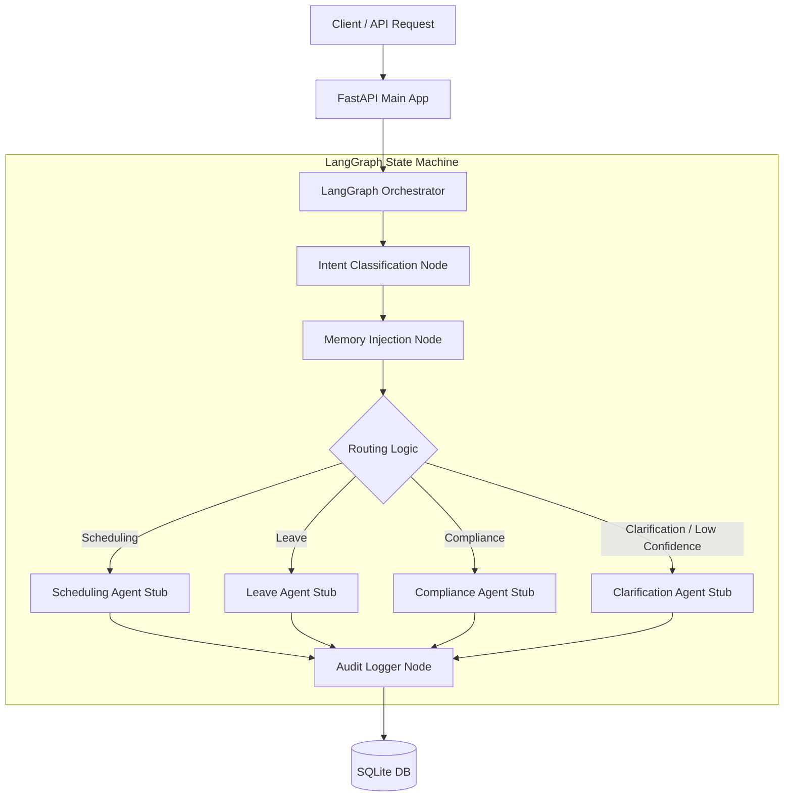

# HR Automation: Multi-Agent Task Routing & Memory Engine

A state-of-the-art Multi-Agent task routing and memory orchestration engine developed for an HR automation platform. Built using **FastAPI** for core REST API endpoints and **LangGraph** for dynamic intent-based routing. The system features a custom significance scoring model to manage Short-Term Memory (STM) vs. Long-Term Memory (LTM), alongside a secure, append-only SQLite audit log.

---

## 🚀 Key Features
- **Central Orchestrator (LangGraph)**: Dynamic state-driven routing system that parses natural language queries and assigns a confidence score.
- **Dedicated Sub-Agent Stubs**: Clean separation of concerns with isolated agent modules (*Scheduling, Leave, Compliance, Clarification*) backed by automatic retry loops and network timeout resilience.
- **Two-Tier Memory Model**: Dynamically promotes persistent facts to Long-Term Memory (LTM) based on a custom significance scoring algorithm, while keeping ephemeral contexts in Short-Term Memory (STM).
- **Append-Only Auditing**: Strictly logs every single request routing path and execution status into a tamper-proof SQLite database table with no write overrides or delete features.
- **Robust REST API (FastAPI)**: Implements 5 validated REST endpoints featuring custom global error handling to prevent internal stack trace leakage.

---

## 📐 System Architecture



---

## 🛠️ Local Development Setup Instructions

Follow these step-by-step instructions to get the application up and running on your local machine:

### 1. Prerequisites
Ensure you have **Python 3.11+** installed on your system. You can verify this by running:
```bash
python --version
```

### 2. Open the Project
Open your terminal or IDE (like VS Code) and navigate to the project directory:
```bash
cd "D:\Company assignment\Zeloartech"
```

### 3. Setup Virtual Environment
Create a self-contained virtual environment to manage dependencies:
```bash
# Create virtual environment
python -m venv venv

# Activate on Windows PowerShell:
.\venv\Scripts\activate

# Or Activate on Linux/macOS:
source venv/bin/activate
```

### 4. Install Dependencies
Install all required modules from `requirements.txt`:
```bash
pip install -r requirements.txt
```

### 5. Run Integration Tests
We have included a comprehensive test suite to verify all endpoints, database connections, and orchestrator nodes:
```bash
python test_endpoints.py
```
*If everything is configured correctly, you will see a `All tests passed successfully!` message.*

### 6. Run FastAPI Server
Start the live Uvicorn development server:
```bash
python main.py
```
The server will boot at **`http://127.0.0.1:8000`**.

### 7. Interactive API Testing (Swagger UI Docs)
Once the server is running, open your web browser and visit:
👉 **[http://127.0.0.1:8000/docs](http://127.0.0.1:8000/docs)**

This opens the interactive OpenAPI documentation where you can manually query the API endpoints, view data structures, check audit logs, and inspect STM/LTM.

---

## 📂 Core Endpoints Exposure
- `GET /health`: Server health state.
- `POST /api/request`: Processes natural language request through LangGraph pipeline.
- `GET /api/audit`: Returns append-only audit trail logs.
- `POST /api/memory`: Manually adds a user memory record.
- `GET /api/memory/{user_id}`: Returns categorised user STM and LTM records.
